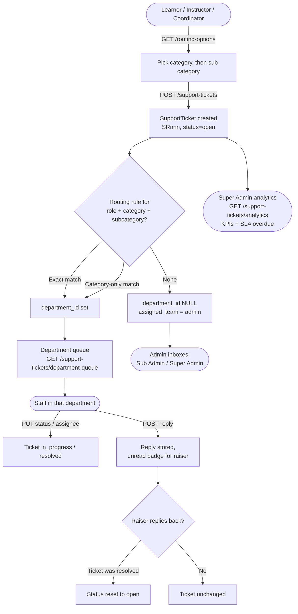
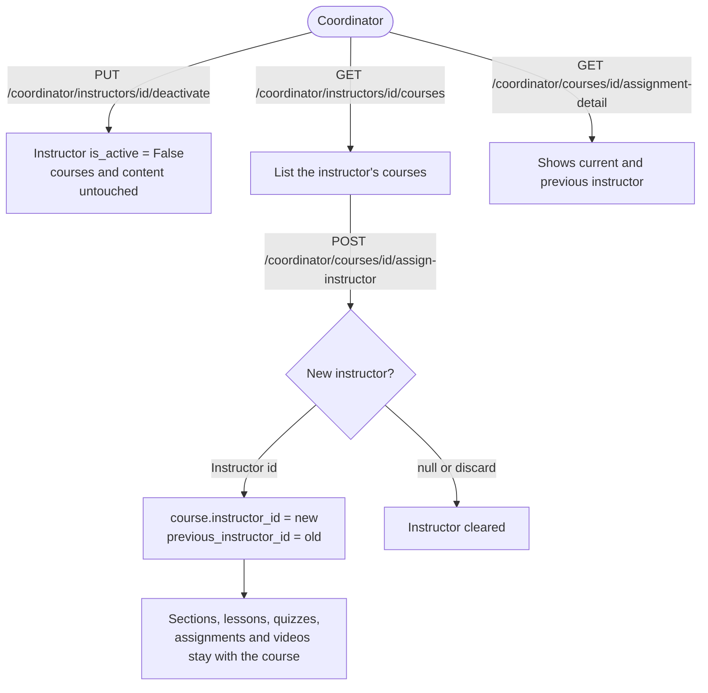

# Platform Workflow Flowcharts

> **Updated**: flowchart 5 (custom payout rate), flowchart 6 (department routing) and new flowchart 8 (instructor reassignment).
>
> All diagrams are based on actual backend code — router logic, status transitions, and service calls verified before drawing.

---

## 1. Course Creation → Coordinator Approval → Publish Lifecycle

**Code basis:**
- `PUT /instructor/courses/{id}/publish` → `instructor.py:toggle_publish()` — sets status to `pending_review` (from `draft` or `rejected`) or back to `draft` (from `published`/`pending_review`)
- `PUT /coordinator/courses/{id}/approve` → `coordinator.py:approve_course()` → sets `course.status = "published"`
- `PUT /coordinator/courses/{id}/reject` → `coordinator.py:reject_course()` → sets status back to `draft`, stores `rejection_reason`
- Sub Admins and Super Admins have parallel approve/reject endpoints that do the same thing

```mermaid
flowchart TD
    A([Instructor]) -->|POST /instructor/courses| B[Course created\nstatus = 'draft']
    B --> C{Instructor builds\ncurriculum\nSections + Lessons}
    C -->|PUT /instructor/courses/{id}/publish| D[status = 'pending_review'\nrejection_reason cleared]
    D --> E([Coordinator / Sub Admin / Super Admin])
    E -->|GET /coordinator/courses/pending| F[Reviews pending queue]
    F -->|GET /coordinator/courses/{id}/preview| G[Previews course content]
    G --> H{Decision}
    H -->|PUT .../approve| I[status = 'published'\nListed on public catalog]
    H -->|PUT .../reject + reason| J[status = 'draft'\nrejection_reason stored]
    J -->|Instructor edits & re-submits| D
    I --> K([Learners can now enroll])

    style I fill:#22c55e,color:#fff
    style J fill:#ef4444,color:#fff
    style D fill:#f59e0b,color:#fff
```

---

## 2. Enrollment → Accounts Approval → Access Granted

**Code basis:**
- `POST /learner/enroll/{course_id}` → `learner.py:enroll_in_course()` — creates `Enrollment(status="pending")` + a mock `Transaction(status="completed", payment_method="mock")`
- Comment in code: _"No external payment gateway; #55 remains MISSING"_ — this is a mock flow
- `PUT /accounts/enrollments/{id}/approve` → `accounts.py` → sets `enrollment.status = "approved"` — this is what actually grants lesson access
- `PUT /accounts/enrollments/{id}/reject` → sets `enrollment.status = "rejected"`
- `ensure_lesson_access()` in `transcripts.py` and elsewhere checks for `enrollment.status == "approved"`

```mermaid
flowchart TD
    A([Learner]) -->|Views published course| B[Course Detail Page\nGET /public/courses/{id}]
    B -->|Clicks Enroll| C[POST /learner/enroll/{course_id}]
    C --> D[Enrollment created\nstatus = 'pending'\nMock Transaction created\npayment_method = 'mock']
    D --> E([Accounts Team])
    E -->|GET /accounts/enrollments| F[Reviews pending enrollments queue]
    F --> G{Decision}
    G -->|PUT .../approve| H[enrollment.status = 'approved'\nLearner can access lessons]
    G -->|PUT .../reject| I[enrollment.status = 'rejected'\nLearner cannot access lessons]
    H --> J([Learner sees course in\nMy Courses dashboard])
    J -->|GET /learner/courses/{id}/detail| K[Lesson Viewer unlocked]

    style H fill:#22c55e,color:#fff
    style I fill:#ef4444,color:#fff
    style D fill:#f59e0b,color:#fff
```

> ⚠️ **Known limitation**: The platform currently has no real payment gateway integrated (noted as issue #55 in the codebase). `payment_method = "mock"` is hardcoded. The Accounts manual approval step exists specifically to compensate for this gap.

---

## 3. Video Upload → Background Transcoding → Lesson Ready

**Code basis:**
- `POST /instructor/lessons/{id}/upload-video` → `instructor.py:upload_lesson_video()` — saves raw file, enqueues `BackgroundTasks`
- Background task `_transcode_and_transcribe_bg()` (lines ~470–592 instructor.py):
  1. FFmpeg: transcode to H.264 MP4
  2. FFmpeg: extract JPEG thumbnail from frame 1
  3. ffprobe: extract duration
  4. DB: update `lesson.video_url`, `lesson.thumbnail_url`, `lesson.duration`
  5. Call `transcribe_lesson_video(lesson_id, out_path)` → runs faster-whisper `base` model (CPU, INT8)
- `get_ffmpeg_executable()` checks 4 locations: configured `FFMPEG_PATH`, system PATH, WinGet links folder, node_modules fallback

```mermaid
flowchart TD
    A([Instructor]) -->|POST /instructor/lessons/{id}/upload-video| B[Raw file saved to\n/media/videos/raw/]
    B --> C[HTTP 200 returned\nimmediately to instructor]
    C --> D[Background Task starts\n_transcode_and_transcribe_bg]
    D --> E[FFmpeg: Locate binary\nFFMPEG_PATH → PATH → WinGet → node_modules]
    E --> F{FFmpeg found?}
    F -->|No| Z[Error logged\nLesson has no video_url]
    F -->|Yes| G[FFmpeg: Transcode raw → H.264 MP4\nSaved to /media/videos/]
    G --> H[FFmpeg: Extract JPEG thumbnail\nfrom frame at 1s]
    H --> I[ffprobe: Extract video duration]
    I --> J[DB update:\nlesson.video_url\nlesson.thumbnail_url\nlesson.duration_minutes]
    J --> K[transcribe_lesson_video called]
    K --> L[Transcript row created\nstatus = 'processing']
    L --> M[FFmpeg: Extract 16kHz mono WAV]
    M --> N[faster-whisper base model\nCPU / INT8 quantized]
    N --> O[Segments collected]
    O --> P[DB: Transcript saved\nstatus = 'completed']
    P --> Q([Learner can GET /transcripts/lesson/{id}])
    G -->|Cleanup| R[Raw file deleted from disk]

    style C fill:#3b82f6,color:#fff
    style Z fill:#ef4444,color:#fff
    style P fill:#22c55e,color:#fff
```

---

## 4. Refund Request → Accounts Approval → Access Revoked

**Code basis:**
- `POST /learner/transactions/{id}/request-refund` → `learner.py` — creates `RefundRequest(status="pending")`
- `PUT /accounts/refunds/{id}/approve` → `accounts.py:approve_refund()`:
  - `rr.status = "approved"`
  - `enrollment.status = "refunded"` (revokes access — only `"approved"` grants access)
  - `transaction.refund_status = "refunded"`
- `PUT /accounts/refunds/{id}/reject` → `accounts.py:reject_refund()`:
  - `rr.status = "rejected"`, enrollment untouched (learner keeps access)
  - `transaction.refund_status = "rejected"`

```mermaid
flowchart TD
    A([Learner]) -->|GET /learner/transactions| B[Views Purchase History]
    B -->|Clicks Request Refund| C[POST /learner/transactions/{id}/request-refund\nwith reason]
    C --> D[RefundRequest created\nstatus = 'pending'\nEnrollment unchanged - learner still has access]
    D --> E([Accounts Team])
    E -->|GET /accounts/refunds| F[Reviews pending refund queue]
    F --> G{Decision}
    G -->|PUT /accounts/refunds/{id}/approve| H[RefundRequest.status = 'approved'\nenrollment.status = 'refunded'\ntransaction.refund_status = 'refunded']
    G -->|PUT /accounts/refunds/{id}/reject| I[RefundRequest.status = 'rejected'\nEnrollment unchanged\ntransaction.refund_status = 'rejected']
    H --> J([Learner loses course access\nCourse disappears from My Courses])
    I --> K([Learner retains course access])

    style H fill:#ef4444,color:#fff
    style I fill:#22c55e,color:#fff
    style D fill:#f59e0b,color:#fff
```

---

## 5. Instructor Payout Flow

**Code basis:**
- `GET /accounts/payouts` → `accounts.py:list_instructor_payouts()`:
  - Queries all instructors
  - For each, sums `course.price` for all `Enrollment(status="approved")`
  - Applies 20% flat platform fee (`_PLATFORM_FEE_RATE = 0.20`)
  - Shows `gross`, `fee`, `net_payout`, and `last_paid_at`
- `POST /accounts/payouts/{instructor_id}/mark-paid` → `accounts.py:mark_instructor_paid()`:
  - Creates an `InstructorPayout` row (snapshot of gross/fee/net at time of payout)
  - **No real money is moved** — the comment in code says _"⚠️ Estimated figures — no real payment system is connected"_

```mermaid
flowchart TD
    A([Learners enroll\nin Instructor's courses]) -->|enrollment.status = 'approved'| B[Earnings accumulate:\nSum of course.price\nfor approved enrollments]
    B --> C[Instructor share = instructor_payout_rate if set,\nelse 80% default. Platform keeps the rest]
    C --> D([Accounts Team])
    D -->|GET /accounts/payouts| E[Views per-instructor\nearnings breakdown]
    E --> F{Decides to pay instructor\nvia external channel\ne.g. bank transfer / PayPal}
    F -->|External payment sent manually| G[POST /accounts/payouts/{instructor_id}/mark-paid]
    G --> H[InstructorPayout row created:\nperiod_label, gross, fee, net\nmarked_paid_at, marked_paid_by]
    H --> I[Instructor sees payout in\nGET /instructor/earnings]

    style G fill:#22c55e,color:#fff
    style F fill:#f59e0b,color:#fff
```

> ⚠️ **Known limitation**: No real payment integration exists. `mark-paid` is purely a record-keeping action. The `net_payout` is estimated from the current enrollment snapshot and does **not** account for already-paid-out amounts (no running balance/ledger subtraction).

---

## 6. Support Ticket Lifecycle (department routing)

**Code basis:**
- `support.py` — `GET /support-tickets/routing-options` supplies category / sub-category dropdowns for the caller's role from `ticket_routing_rules`.
- `POST /support-tickets` (roles `learner`, `instructor`, `coursecoordinator`) looks up `(role, category, subcategory)` → `department_id`, falls back to a category-only rule, otherwise `department_id` stays `NULL` and legacy `assigned_team="admin"`. Ticket numbers are `SRnnn`.
- Department users work tickets through `/support-tickets/department-queue*` (requires `users.department_id`; the ticket must belong to that department).
- Accounts, Sub Admin and Super Admin keep their own inbox endpoints; Super Admin also has `/support-tickets/analytics`.
- Unread badge: `last_activity_at > last_read_at` and `last_activity_by != self` (`TicketRead`).
- A reply by the raiser re-opens a resolved ticket (`open`); a reply by department staff moves a resolved/closed ticket to `in_progress`.
- Audit events are logged via `app/services/audit.py` (e.g. `ticket_created`).



---

## 7. Transcript System — Automatic (FFmpeg/Whisper) vs Manual Paste (YouTube)

**Code basis:**
- `services/transcription.py` — two distinct paths:
  1. **Automatic** (`transcribe_lesson_video`): triggered after video upload, uses FFmpeg → WAV → faster-whisper `base` model
  2. **Manual paste** (`parse_pasted_transcript`): instructor pastes YouTube auto-generated captions text; parser supports formats like `M:SS text`, `[00:00](url) text`, and alternating timestamp/text lines
- `GET /transcripts/lesson/{id}` and `GET /transcripts/live-class/{id}` — access gated by `ensure_lesson_access()` / `ensure_live_class_access()`

```mermaid
flowchart TD
    A([Instructor uploads lesson video]) --> B[POST /instructor/lessons/{id}/upload-video]
    B --> C[Background: FFmpeg transcode]
    C --> D[transcribe_lesson_video called\nTranscript.status = 'processing']
    D --> E[FFmpeg: extract 16kHz mono WAV]
    E --> F[faster-whisper base model\nCPU / INT8]
    F --> G[Segments collected]
    G --> H[Transcript.status = 'completed'\nstored in DB with segments + full_text]

    A2([Instructor has YouTube-hosted lesson]) --> B2{Can backend access\nYouTube transcript API?}
    B2 -->|"Yes (not IP-blocked)"| C2[Automatic fetch attempted\nNeeds Verification - not confirmed in code]
    B2 -->|"No (IP-blocked or unsupported)"| D2[Instructor manually copies\nYouTube caption text]
    D2 --> E2[Pastes into LessonForm\ntranscript_text field]
    E2 --> F2[POST /instructor/lessons/{id}\nwith transcript_text payload]
    F2 --> G2[parse_pasted_transcript called\nParses timestamps: M:SS / H:MM:SS\nalso handles markdown link format]
    G2 --> H2[Transcript saved\nwhisper_model = 'manual-paste'\nTranscript.status = 'completed']

    H --> I([GET /transcripts/lesson/{id}])
    H2 --> I

    I --> J{Access check\nensure_lesson_access}
    J -->|"Preview lesson OR\nApproved enrollment OR\nStaff / Instructor"| K[Transcript returned\nwith segments array]
    J -->|Unauthorized| L[HTTP 403 Forbidden]

    style H fill:#22c55e,color:#fff
    style H2 fill:#22c55e,color:#fff
    style L fill:#ef4444,color:#fff
    style C2 fill:#f59e0b,color:#000
```

> ⚠️ **Known limitation**: YouTube's transcript API may block server IPs. The `manual-paste` path exists specifically as a workaround. The `whisper_model` field is set to `"manual-paste"` (not an actual model name) to flag manually-entered transcripts in the database.

---

## 8. Instructor Reassignment (Coordinator)

**Code basis:** `coordinator.py` — `deactivate_instructor`, `get_instructor_courses`, `assign_instructor_to_course`, `get_course_assignment_detail`.


